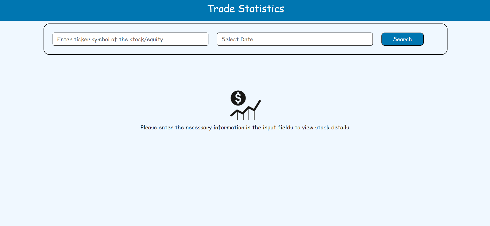

# Frontend Task for Essentially AI

## Steps to Build the Project
1. Start by cloning this repository to your local machine.
2. Run `npm install` separately for both the client and server to install the required dependencies.
3. Launch the server using `npm start` for both the client and server separately.

## Frontend Features
1. Users can input the symbol and date of the stock they want to view.
2. After submitting the form, the stockDetails functionality dispatches an API call to the local server at api/fetchStockData.
3. The stock data, including close, open, volume, symbol, and volume, is displayed in a table format.
4. Error and success messages are handled for the API responses.
5. A loader component is implemented to enhance the user experience during loading.
6. Redux is used for state management, allowing data storage, and Thunk is used to make asynchronous API calls.

## Backend Features
1. The API endpoint api/fetchStockData is handled on the server side.
2. The server calls the polygon.io API to fetch data from the polygon.io platform.
3. Cache is used to optimize API response time and reduce unnecessary calls.
